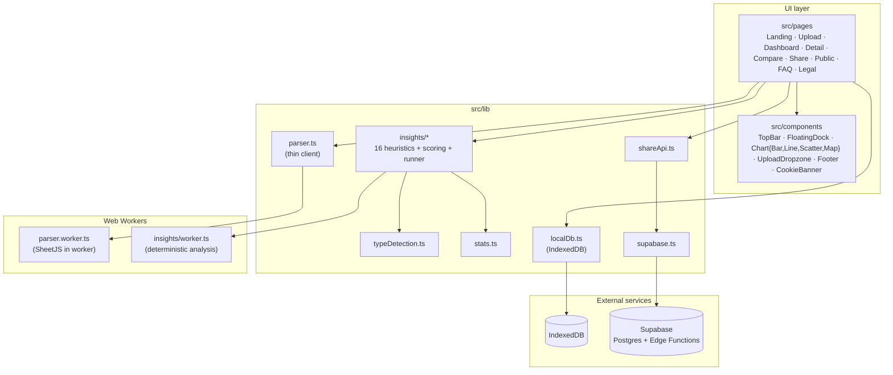
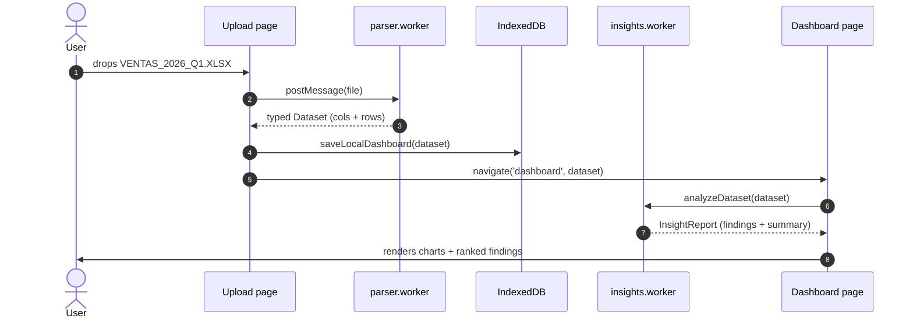
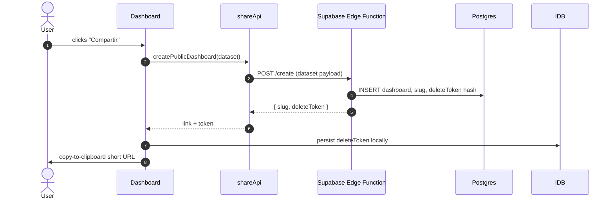

# Architecture

This is the technical map of Excel to Sky: what the modules are, how data flows through them, and why a few non-obvious decisions were made the way they were. If you just want to run the project, the README has you covered; if you want to extend it, start here, then move to [CONTRIBUTING.md](./CONTRIBUTING.md) and the per-module READMEs.

## Module diagram

Two rules to read this diagram by:

- **Pages own the routing and the dataset state.** Everything else is a service called by pages.
- **Workers are not in the import graph from UI components.** They are spawned via `new Worker(new URL('./worker.ts', import.meta.url))` in the corresponding `lib/*` entry point — that's the boundary.

## Data flow

The interesting story is what happens between dropping a file and rendering a dashboard:

What happens on **Share**:

A few invariants worth highlighting:

- **Steps 1–4 of the first diagram never reach the network.** Parsing happens entirely in `parser.worker.ts`. The `Dataset` object lives in memory and, optionally, in IndexedDB. There is no upload until the explicit "Compartir" click in the second diagram.
- **The deleteToken is hashed before it is stored server-side.** The plain-text token only lives in the user's IndexedDB.
- **Dashboards are immutable snapshots once shared.** Updating the source spreadsheet means sharing a new one — see the FAQ.

## Why a Web Worker

There are two CPU-heavy stages: parsing XLSX/CSV files and running the insights engine. Both can run for hundreds of milliseconds on real-world spreadsheets. Running them on the main thread would block:

- Scrolling and input handling (the page would feel frozen).
- The CookieBanner / FloatingDock animations.
- The dashboard reveal animation in the hero (which is `requestAnimationFrame`-driven).

The cost of moving to a worker is small (a structured-clone of the input + output), and the worker pays for itself the first time a user drops a 200-row file. Both workers are spawned ad-hoc and terminated after the message round-trip — there is no long-lived worker pool to manage.

If you are adding a new CPU-bound operation that takes more than roughly 50 ms in production data, write it as a worker. The `insights/worker.ts` and `parser.worker.ts` files are short — they show the cleanest pattern to copy.

## Why no LLM

This was the most consequential early decision. The insights engine is **pure deterministic statistics**: z-scores, gini coefficients, Pearson correlations, time-density gaps, distribution shape classifiers — all of it computable from primitive math. No model is loaded, no API is called. The full rationale is captured in [`docs/adr/0001-no-llm.md`](./docs/adr/0001-no-llm.md), but the short version is:

1. **Privacy.** An LLM means data leaves the browser. That contradicts the central product claim.
2. **Cost.** The product is intended to be free and ad-supported. Per-call inference cost is incompatible with that economics.
3. **Latency.** A 4 s analysis is acceptable; a 12 s LLM round-trip is not.
4. **Determinism.** Two visitors of the same shared dashboard must see the same findings in the same order, forever. That is much harder with non-deterministic generation.
5. **Inspectability.** A heuristic is a function. A model is an opaque artifact. When something looks wrong on a real spreadsheet, you want to read code, not poke a prompt.

Where the LLM is genuinely useful — phrasing narrative connective tissue, picking a headline, finding an analogy — it can be re-introduced _strictly on top of_ the statistical layer once the narrative renderer (sub-project #3) is in place, and only if it can run with consent and on hashed/redacted summaries. That is a future ADR.

## Storage model

There are exactly two places where data lives:

| Where                                          | What                                                                                                    | Why                                                                                                                   |
| ---------------------------------------------- | ------------------------------------------------------------------------------------------------------- | --------------------------------------------------------------------------------------------------------------------- |
| **Browser IndexedDB** (`localDb.ts`)           | Datasets the user has opened, dashboard metadata (slug + deleteToken), settings.                        | Lets us reopen recent dashboards without re-uploading, and stores the deleteToken needed to remove shared dashboards. |
| **Supabase Postgres** (only via `shareApi.ts`) | Public-shared dashboards. Schema: `id`, `slug`, `data`, `deleteTokenHash`, `createdAt`, `lastViewedAt`. | Required to serve a public URL. Region UE only.                                                                       |

No third place. If you are tempted to add `localStorage` for anything other than tiny UI preferences (e.g. the cookie banner's dismissed flag), think twice — IndexedDB is the canonical store.

## Build, deploy, and constraints

- **Build:** `npm run build` → `dist/`. Static assets only. The whole app is shipped as a single SPA.
- **Hosting target:** any static host. The current plan is a Linode/Hetzner VPS behind nginx; Vercel/Netlify would also work.
- **Bundle budget:** we have not enforced one yet, but the moral budget is ~150 KB gzip for the main entry. The parser worker (~330 KB raw, mostly SheetJS) ships separately.
- **Browser support:** evergreen Chromium, Firefox, Safari. No IE / no transpile down to ES5.

## Where to go next

- Want to add a new heuristic? → [`src/lib/insights/README.md`](./src/lib/insights/README.md)
- Want to change a project-wide decision? → write an ADR under [`docs/adr/`](./docs/adr/) and link it from the PR.
- Want to send a PR? → [CONTRIBUTING.md](./CONTRIBUTING.md).
