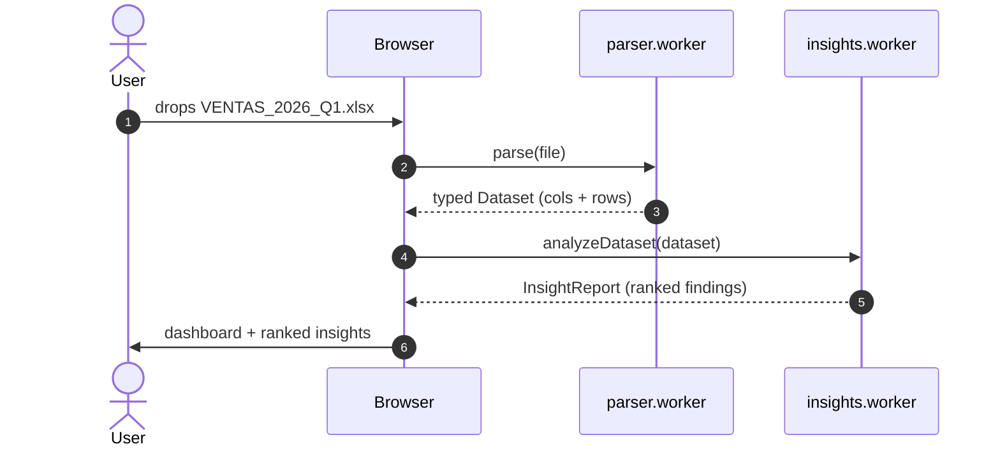

# Excel to Sky

[](https://developer.chrome.com/docs/lighthouse/overview)

Turn any Excel into a beautiful, explorable dashboard in seconds — without sending a single byte to the cloud.

> **About the Lighthouse badge.** Excel to Sky targets a Lighthouse score of 100/100/100/100 (Performance · Accessibility · Best Practices · SEO) on the landing page. Automated per-PR verification is tracked separately under the `devex` label; until that workflow lands, the score is checked manually on each release.

The end goal is a narrative scrollytelling experience (think Pudding or Bloomberg pieces) auto-generated from a spreadsheet in under a minute. This repository contains the foundations: the dashboard base and the statistical insights engine that powers everything that comes next.

## What it does today

- **Drop an Excel or CSV** into the browser and get a typed dataset (numbers, currencies, dates, categories, text, geo, booleans) detected automatically.
- **Browse a dashboard** with column-level detail pages, comparison view, and a public-share link backed by Supabase.
- **Analyze locally** with a deterministic insights engine that produces a ranked report of up to 16 different kinds of findings (outliers, correlations, group disparities, distribution shapes, temporal gaps, quality scores, and more).
- **Dark, low-chrome UI** with rectangular corners and a sky / mint / plum accent palette.

## Why it exists

Most BI tools force you to set up databases, write SQL, or upload sensitive data to a vendor. Excel to Sky goes the other way:

- **100% local.** Parsing and analysis happen in the browser. No file, no row, no cell ever leaves the device — unless you explicitly create a public share link.
- **No LLM.** The insights engine is pure statistical heuristics. Zero API costs, zero latency, deterministic output.
- **Narrative-first.** The roadmap is to compose insights into a readable story, not just throw charts at the user.

## How it works



Steps 1–5 never reach the network. Sharing is a separate, explicit user action that copies a snapshot to Supabase (UE) in exchange for a public short URL. See [ARCHITECTURE.md](./ARCHITECTURE.md) for the module diagram, the Share-flow sequence, and the rationale for using Web Workers and skipping LLMs.

## Tech stack

- TypeScript 5, React 18, Vite 5
- Web Workers for parsing and analysis (UI never blocks)
- Supabase (Postgres + Edge Functions) for optional public sharing
- IndexedDB for local dashboard history
- Tailwind CSS for the UI, no chart library — custom SVG rendering throughout

## Run locally

```bash
git clone git@github.com:FuujiiN83/Excel-to-sky.git
cd Excel-to-sky
npm install
npm run dev
```

Then open `http://localhost:5173`.

### Optional: enable the sharing backend

Create `.env.local` (see `.env.example`) with your own Supabase project credentials. Without it, the app still works fully — sharing UI just stays disabled.

### Developer routes

- `/dev/insights` — interactive workbench to run the insights engine against three bundled sample datasets and inspect the ranked findings.

## Repository layout

```
src/
├── lib/
│   ├── insights/           # Statistical insights engine (16 heuristics + worker)
│   ├── parser.ts           # Excel/CSV parsing, runs in a worker
│   ├── stats.ts            # Shared math helpers
│   ├── typeDetection.ts    # Column type inference
│   ├── shareApi.ts         # Supabase Edge Function client
│   ├── localDb.ts          # IndexedDB persistence
│   └── supabase.ts         # Client config
├── pages/                  # Upload, Dashboard, Detail, Compare, Share, Public, FAQ…
├── components/             # Charts, TopBar, FloatingDock, etc.
├── samples/                # Three bundled datasets for demo and dev
├── dev/                    # Developer-only routes (workbench)
└── types/dataset.ts        # Core Dataset/Column/CellValue types

supabase/
├── migrations/             # Schema (dashboards, rate limits, RPC functions)
└── functions/              # create / delete Edge Functions
```

## Roadmap

Excel to Sky is being built as a sequence of eight self-contained sub-projects. Each one is shippable on its own; the final product is the composition of all of them.

| # | Sub-project | Status |
|---|---|---|
| 1 | Insights engine (16 statistical heuristics) | **Done** |
| 2 | Domain detection + vertical plug-ins (shifts, sales, HR…) | Planned |
| 3 | Story composer (findings → scenes with narrative arc) | Planned |
| 4 | Scrollytelling renderer | Planned |
| 5 | Interactive exploration layer (drill-downs, filters) | Planned |
| 6 | Time-travel comparison between dataset versions | Planned |
| 7 | Advanced sharing (OG cards, PDF export, embeds, white-label) | Planned |
| 8 | Live integrations (Google Sheets, Notion, Airtable) | Planned |

## License

No license yet — the code is published for transparency but is not currently open source. Drop an issue if you want to discuss usage.

## Contact

[franosma83@gmail.com](mailto:franosma83@gmail.com)
